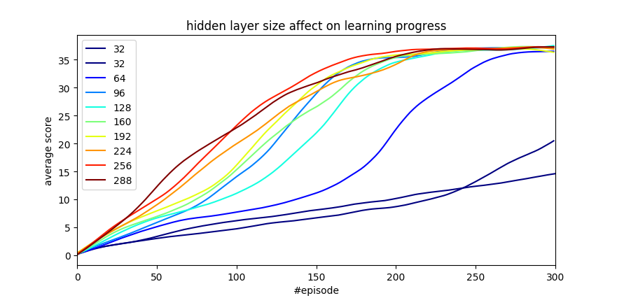

# Continuous Control DRL Project

This repository documents my solution to project #2 in the Udacity nano degree in Deep Reinforcement Learning. The project goal is to write a deep reinforcement learning algorithm which solves the reacher environment.

## Overview

In this environment, a double-jointed arm is controlled to move its hand (blue ball at the tip of the arm) to a moving target location (green moving ball). A reward is provided for each step that the agent's hand is in the goal location. Thus, the goal of the agent is to maintain its position at the target location for as many time steps as possible.

The observation space consists of **33** variables corresponding to position, rotation, velocity, and angular velocities of the arm as well as the position of the target. Each action is a vector with **4** numbers, corresponding to torque applicable at each of the two joints. Every entry in the action vector should be a number between -1 and 1.


In the above animation you can see a similar environment with 10 trained agents (arms) tracking the target green spheres. The environment consisting of multiple agents is desirable when training. 


## The chosen algorithm

According to [Proximal Policy Optimization Algorithms](https://arxiv.org/pdf/1707.06347.pdf), the PPO algorithm studied in the course is a great choice for solving this environment as can be seen in the following figure:


​						**Picture taken from  [Proximal Policy Optimization Algorithms](https://arxiv.org/pdf/1707.06347.pdf)**


## General Approach

Since finding code that solves the above environment is not a huge challenge and not the most educational, I chose to take advantage of this opportunity to study the affect of variable neural network size on performance and learning rate. The code in this repository is based on [Jeremi Kaczmarczyk](https://github.com/jknthn/reacher-ppo.git) and  [ShangtongZhang](https://github.com/ShangtongZhang/DeepRL) git repository and most of the hyper-parameters were basically untouched and met the basis explained in [PPO Hyperparameters and Ranges](https://medium.com/@aureliantactics).

The details of the implementation and the test I made are summarized in the ```report.md``` (in this git repository). The main outcome is the following graph:



The graph shows the learning progession of different agents that differ from each other only by their neural-network hidden layer size. 

One can see the hidden layer size effect on learning rate. What entreeged me the most is that *light* (small) neural networks reach the same final performance (more or less) as much *heavier* ones but in much more episodes.

If you would like to reproduce the results above and\or study other parameter affects (such as learning rate, network architecture, other hyper-parameters), follow the following steps.


## Step 1: Activate the Environment

Follow the [instructions in the DRLND GitHub repository](https://github.com/udacity/deep-reinforcement-learning#dependencies) to set up your Python environment. These instructions can be found in `README.md` at the root of the repository. By following these instructions, you will install PyTorch, the ML-Agents toolkit, and a few more Python packages required to complete the project.

(*For Windows users*) The ML-Agents toolkit supports Windows 10. While it might be possible to run the ML-Agents toolkit using other versions of Windows, it has not been tested on other versions. Furthermore, the ML-Agents toolkit has not been tested on a Windows VM such as Bootcamp or Parallels.


<u>Install Additional packages:</u>

```bash
$ pip install tqdm
$ pip install scipy
```


## Step 2: Download the Unity Environment

For this project, you will **not** need to install Unity - this is because we have already built the environment for you, and you can download it from one of the links below. You need only select the environment that matches your operating system:

### Version 1: One (1) Agent

- Linux: [click here](https://s3-us-west-1.amazonaws.com/udacity-drlnd/P2/Reacher/one_agent/Reacher_Linux.zip)
- Mac OSX: [click here](https://s3-us-west-1.amazonaws.com/udacity-drlnd/P2/Reacher/one_agent/Reacher.app.zip)
- Windows (32-bit): [click here](https://s3-us-west-1.amazonaws.com/udacity-drlnd/P2/Reacher/one_agent/Reacher_Windows_x86.zip)
- Windows (64-bit): [click here](https://s3-us-west-1.amazonaws.com/udacity-drlnd/P2/Reacher/one_agent/Reacher_Windows_x86_64.zip)

### Version 2: Twenty (20) Agents

- Linux: [click here](https://s3-us-west-1.amazonaws.com/udacity-drlnd/P2/Reacher/Reacher_Linux.zip)
- Mac OSX: [click here](https://s3-us-west-1.amazonaws.com/udacity-drlnd/P2/Reacher/Reacher.app.zip)
- Windows (32-bit): [click here](https://s3-us-west-1.amazonaws.com/udacity-drlnd/P2/Reacher/Reacher_Windows_x86.zip)
- Windows (64-bit): [click here](https://s3-us-west-1.amazonaws.com/udacity-drlnd/P2/Reacher/Reacher_Windows_x86_64.zip)

Then unzip (or decompress) the file. Rename directory to ```Reacher_Linux_1agent``` or ```Reacher_Linux_multAgents``` .

(*For Windows users*) Check out [this link](https://support.microsoft.com/en-us/help/827218/how-to-determine-whether-a-computer-is-running-a-32-bit-version-or-64) if you need help with determining if your computer is running a 32-bit version or 64-bit version of the Windows operating system.


## Step 3

Clone this repository and run the following.

To reproduce the results:

```bash
$python reacher-ppo/Solution.py --numEpisodes 300 --gridSrchHidden 32 64 96 128 160 192 224 256 288
```

For plotting former results:

```bash
$python reacher-ppo/Solution.py --pltLrn
```


For a deeper understanding of this project refer to the ```report.md``` file.

