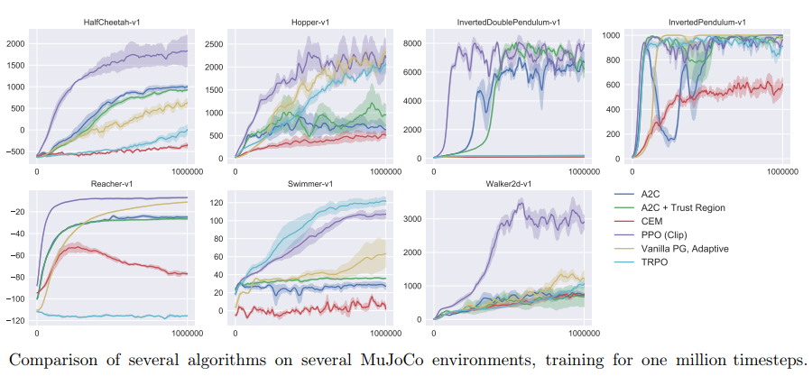
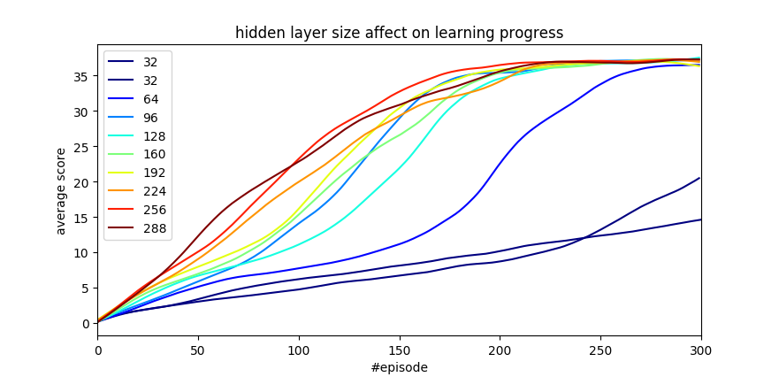

# Continuous Control Project Report


After encountering the paper [Proximal Policy Optimization Algorithms](https://arxiv.org/pdf/1707.06347.pdf) which shows fast convergence of PPO on reacher environment, I chose to use PPO for solving the reacher environment.



​						**Picture taken from  [Proximal Policy Optimization Algorithms](https://arxiv.org/pdf/1707.06347.pdf)**


The implementation is based on [Jeremi Kaczmarczyk](https://github.com/jknthn/reacher-ppo.git) and  [ShangtongZhang](https://github.com/ShangtongZhang/DeepRL) git repository and most of the hyper-parameters were basically untouched and met the basis explained in [PPO Hyperparameters and Ranges](https://medium.com/@aureliantactics).

<u>**Actor:**</u>

Network:

state 33 --> 33 to NN (FC) --> relu --> <u>NN to NN (FC)</u> --> relu --> NN to 4 (FC) --> tanh

The network yields expected action (ea).

The expected action along with agents std tensor constructs a Normal distribution of N(ea, std) from which the following is obtained:

```
action, log_prob, dist.entropy()
```

**<u>Critic</u>**

Network:

state 33 --> 33 to NN (FC) --> relu --> <u>NN to NN (FC)</u> --> relu --> 512 to 1 (FC)

The network yields a the value of the given state: 

```v```

**<u>NN</u>** - is the hidden layer size. This is the hyper-parameter I chose to study in this project.

 

**<u>The implementation:</u>**

1. Interact with environment for 'rollout_length':

   1. For each time step Use state and actor-critic networks to obtain actions and values
   2. Use the predicted actions to advance environment. Obtaining next states, rewards and terminals
   3. Append [states, values, actions, log_probs, rewars, not(dones)] into rollout list
   4. Repeat with state = next state

2.  Process rollout to obtain advantages instead of values and returns instead of rewards:

   Run on rollout from end-1 to start

   1. returns[i] = rewards[i] + gamma * returns[i+1] * not(dones)[i]
   2. td_error = rewards[i] + gamma * values[i+1] * not(dones)[i] - values[i]
   3. advantages[i] = advantages[i+1] * gae_tau * gamma * not(dones)[i] + td_error
   4. Append [states, actions, log_probs, returns, advantages] into processed_rollout

3. Go aver all processed_rollout in minibatches while optimizing the networks for minimum loss:

   1. Split all experience (processed_rollout) into 'mini_batch_number' minibatches.
   2. Use actor-critic network and (states, actions) to obtain (log_probs, entropy_loss, values)
   3. Calculate action probability ratio (and clipped ratio) using log_probs and previous log_probs.
   4. Calculate objective be multiplying ratio with advantages and multiplying by -1 (for minimization).
   5. Policy_Loss is basically the average of advantages * ratio
   6. Value_Loss is the average squared error between values and discounted returns.
   7. Optimization step towards reducing (policy_loss + value_loss)


**<u>My Configuration:</u>**

```python
config = {
			'pytorch': {'device': device(type='cuda', index=0)},
			'hyperparameters': {
				'discount_rate': 0.99,
				'tau': 0.95,
				'gradient_clip': 5,
				'rollout_length': 2048,
				'ppo_clip': 0.2,
				'log_interval': 2048,
				'max_steps': 100000.0,
				'mini_batch_number': 32,
				'entropy_coefficent': 0.01,
				'episode_count': 150,
				'hidden_size': None,
				'adam_learning_rate': 0.0003,
				'adam_epsilon': 1e-05
				},
            'environment': {
            	'state_size': 33,
            	'action_size': 4,
            	'number_of_agents': 20
            	}
         }
```


The above obtained the following learning performance:




In the graph above it is apparent that the biggest affect the hidden layer size has on learning is the reduction of convergence time. It seems that around the size of 96 to 128 hidden nodes, the probability of converging under 150 episodes increases dramatically. Under 64 node learning is slower and learning rate is less predictable.


<u>**Ideas for future work:**</u>

Since the maximum reward in one game is < 40, I think that future work would focus mainly on simplifying the network further, rather than trying to increase the maximum score.

Some optional directions:

1. Research influences of convergence time:
   1. An additional hidden layer for actor \ critic. 
   2. Hyper parameters such as number of mini-batches (mini batch size), learning rate (scheduling)...
2. In the actor network add 4 more outputs for predicting $\sigma$ of the Gaussian distribution.
3. Decreasing only the critics network size.


To reproduce the results, install the dependencies as explained in the ```README.md``` file and then run the following commands:

```bash
$python reacher-ppo/Solution.py --numEpisodes 300 --gridSrchHidden 32 64 96 128 160 192 224 256 288
```
```bash
$python reacher-ppo/Solution.py --numEpisodes 400 --gridSrchHidden 32
```
```bash
$python plot_grid_search_results.py
```


<u>**More Resources:**</u>


https://arxiv.org/pdf/1506.02438.pdf

https://arxiv.org/pdf/1804.03720.pdf

https://arxiv.org/pdf/1707.06347.pdf